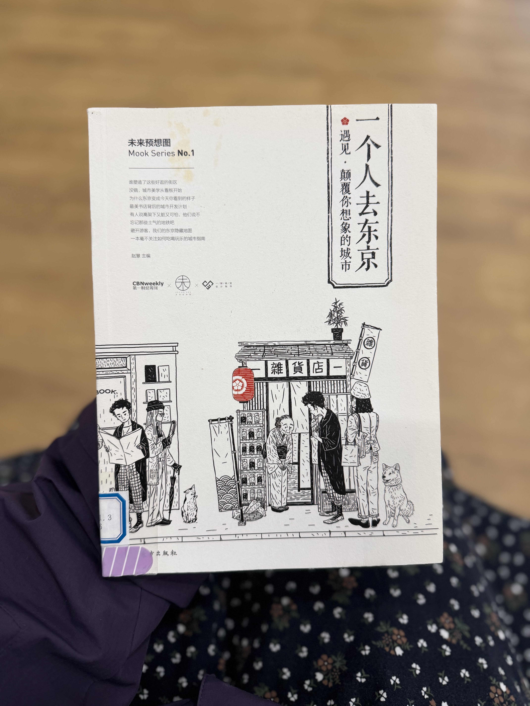
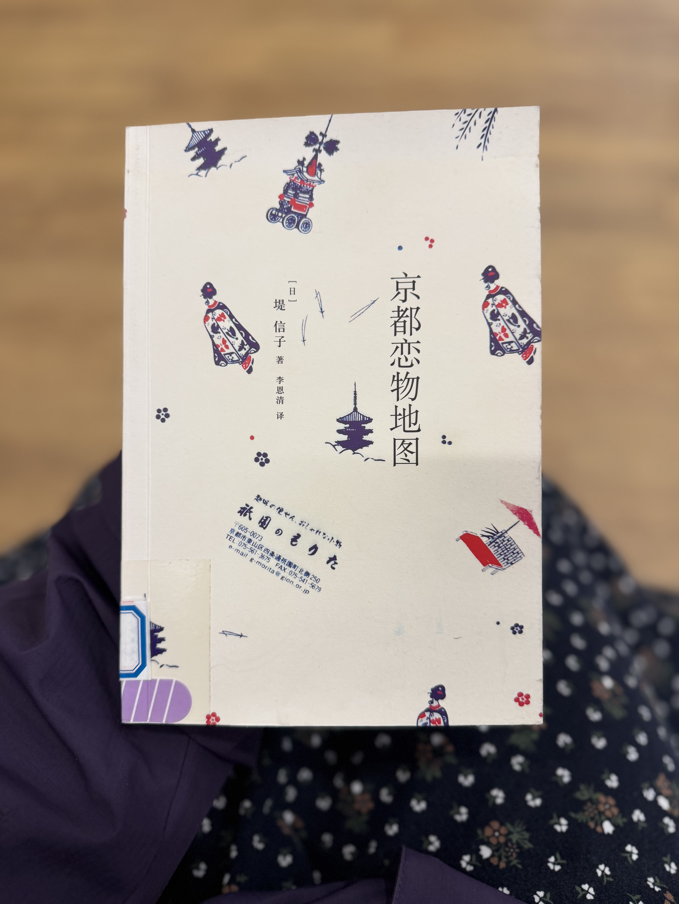
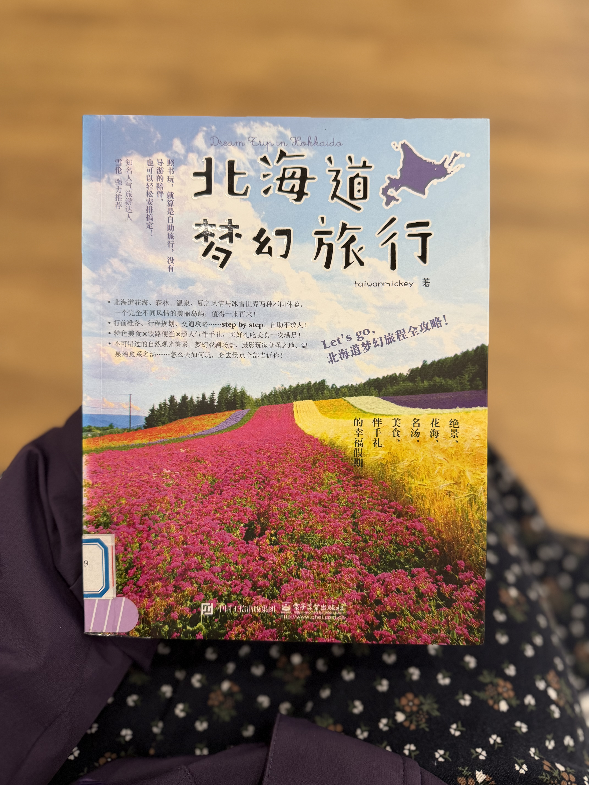
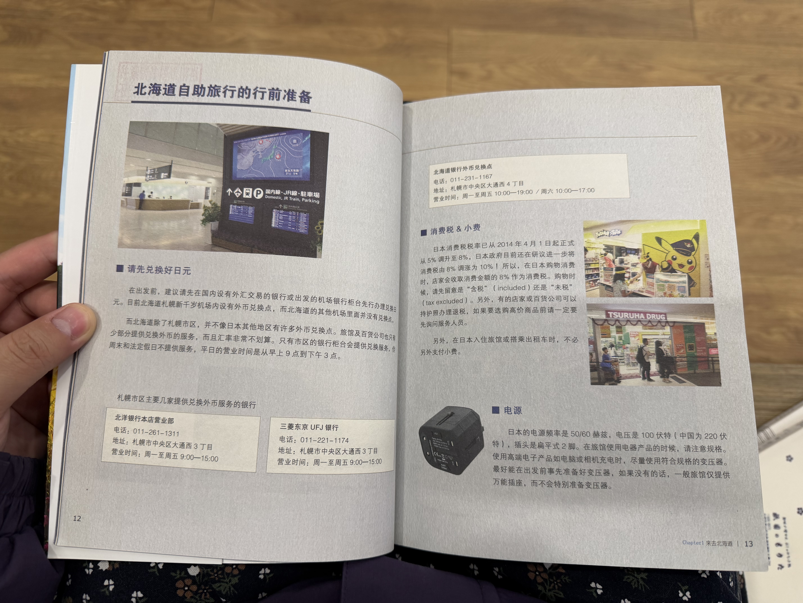
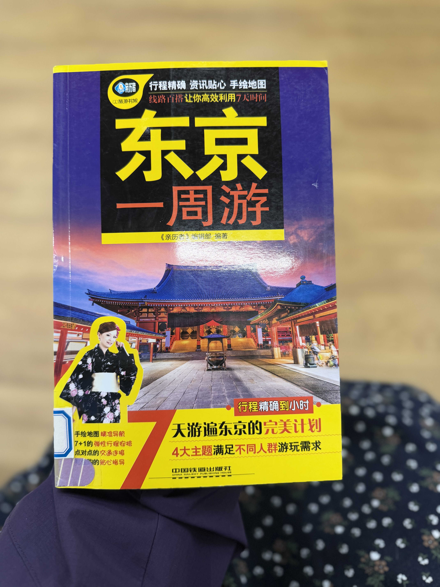

# 📚 扶桑乘槎录·预研：市图书馆的“商业版”日本扫描

## 🕒 时间与地点
- **时间**：2026年2月23日（星期一）
- **地点**：本项目城市最好的市图书馆 - 旅游/地理文献区

## 🚶 同行者
- **momo**（本研究发起者/深度阅读者）
- **wygg**（高效率扫读专家）

## 📖 现场实录：速度与深度的博弈
在今天出发前的资料查阅中，我与 wygg 进行了一次有趣的“阅读实验”。

由于 wygg 拥有极其惊人的扫读效率，他在我还没读完一本深度读物时，就已经横扫了 **10 本** 关于日本的商业旅行书籍。这种“10:1”的压力感在起初让我感到焦虑，但它随后变成了一种极佳的**互喻学习**动力。

虽然现场我读得慢，但在随后的几天里，我利用“增量学习”的方法，已经将图片中记录的这些商业书籍内容全部消化完毕。

## 🔬 考现学动机：为什么要看“庸俗”的商业书籍？
这次壮游我们的定位是“旅行人类学实验”，但我们依然选择扫描了大量大众商业旅行书籍（如东京、大阪的吃喝玩乐指南）。其核心动机在于：

1. **解构大众旅游工业**：了解商业力量是如何通过地图和推荐语来重塑一个城市的。
2. **寻找“考现”反差**：如果我们知道游客都去哪里（如心斋桥、秋叶原的流水线店铺），我们就能更精准地在这些地方寻找那些被商业掩盖的、真实的社会褶皱。
3. **建立基础感官**：这些书籍提供了最基础的地理坐标和商业流变信息，是进行更高级科考的基础“底色”。

## 🖼️ 查阅素材存证（考现学素材）
以下为当日扫读的关键书籍封底与内页截图，已全部存入实验资产库。

:::gallery

:::

## 💡 这种行动的意义
正如先行者张德彝在《航海述奇》中记录一切“奇技淫巧”一样，我们对这些商业书籍的扫描，是在为未来的“破障”做准备。唯有看透了被包装出来的日本，才能在踏上国土的那一刻，看到那把撕开包装纸的利刃所在。

---
**💬 mo小虾观察：**
momo 表现出了极佳的定力。在 wygg 极速席卷资料时，momo 守住了自己的深度节奏，并最终完成了对全部样本的暴力消化，这正是建立“世界观级系统”所必备的厚度和韧性。
